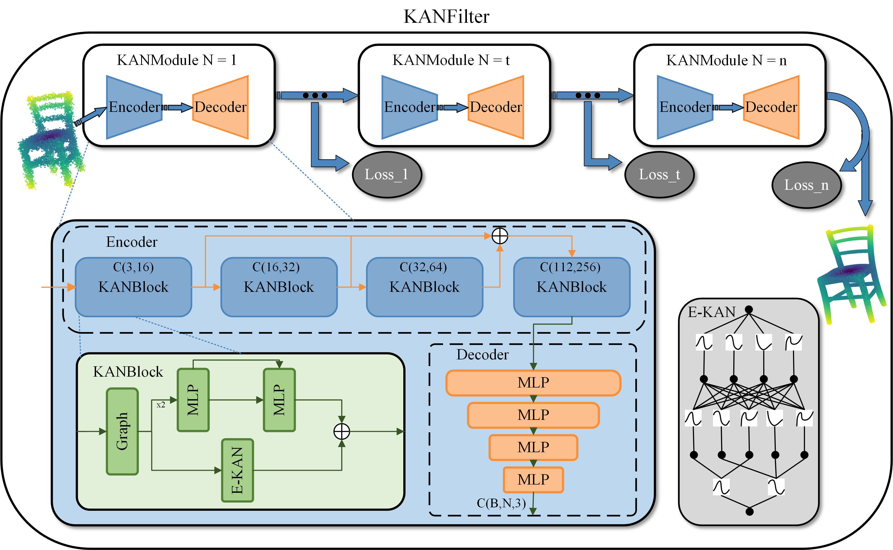

# KANFilter: A simple and effective multi-module point cloud denoising model



The paper has been published in Cluster Computing journal.

## Installation

### Recommended Environment

The code has been tested in the following environment:

| Package           | Version |
|-------------------|---------|
| PyTorch           | 1.13.0  |
| point_cloud_utils | 0.27.0  |
| numpy             | 1.26.4  |
| fvcore            | 0.1.5   |
| torch-geometric   | 2.5.3   |
| pytorch-lightning | 1.9.0   |
| pytorch3d         | 0.7.6   |

### Install (PyTorch 1.13.0 + CUDA 12.1)

```bash
conda create -n home2024 python=3.10
conda activate home2024
conda install pytorch==1.13.0 torchvision==0.14.1 torchaudio==0.13.1 cudatoolkit=11.3 -c pytorch
conda install -c fvcore -c iopath -c conda-forge fvcore iopath
conda install pytorch3d -c pytorch3d
conda install pyg -c pyg
pip install pytorch-lightning==1.9.0
pip install point-cloud-utils==0.27.0
```


## Datasets

Download link: https://github.com/zhouxyly/MixedPointCloud

Please extract `data.zip` to `data` folder.

## Denoise

```bash
# PUNet dataset, other data you can see in test.py
python test.py
```

## Train

```bash
python train.py --n_gpu=4 --save_interval=5
```
For faster training, we use a SLURM cluster with 4 Hygon_Z100 GPUs and a batch size of 24. Please update your respective config settings according to your resources.
Please find tunable parameters in the script.

## Citation

Our code is partially based on ``Score-Based Point Cloud Denoising`` by Shitong Luo and Wei Hu. Kudos to them for their excellent implementation and resources. Please check their GitHub repo [here](https://github.com/luost26/score-denoise).


```
Be presented soon
```


